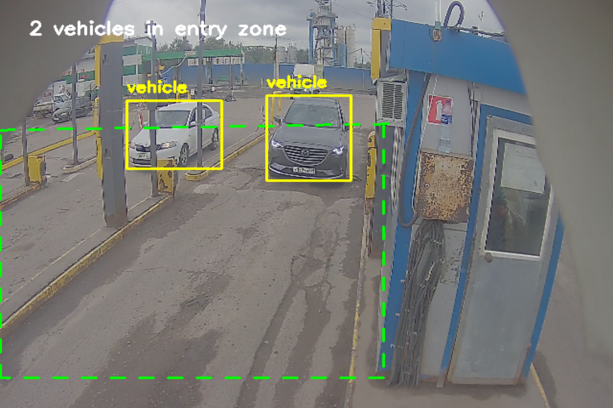
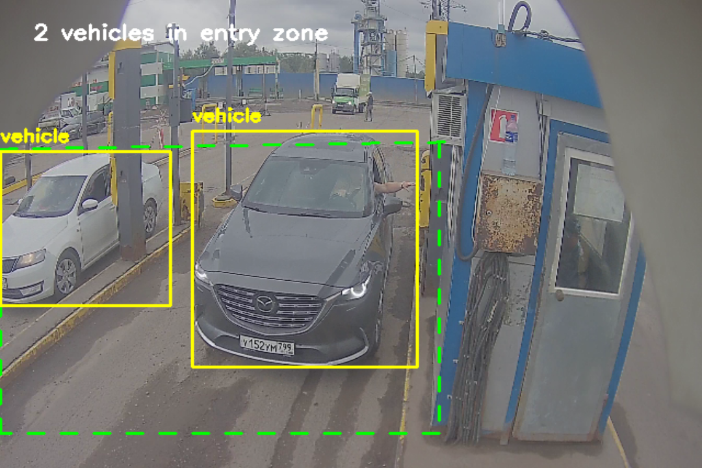
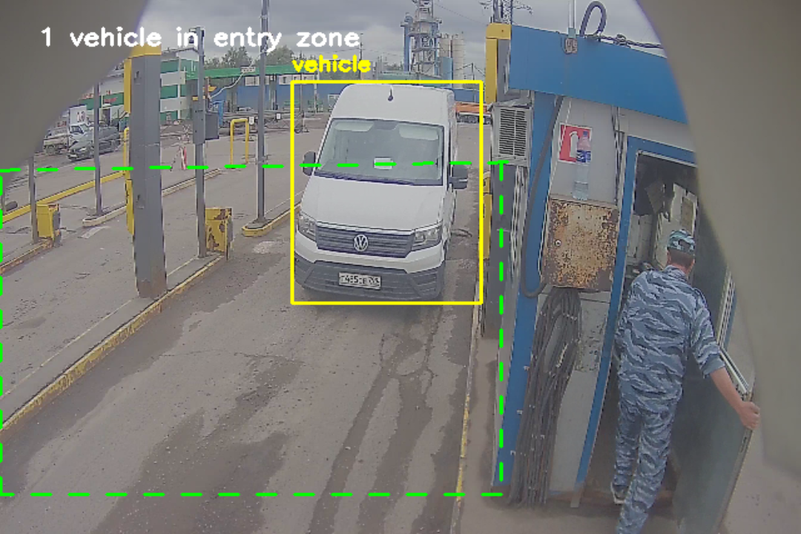
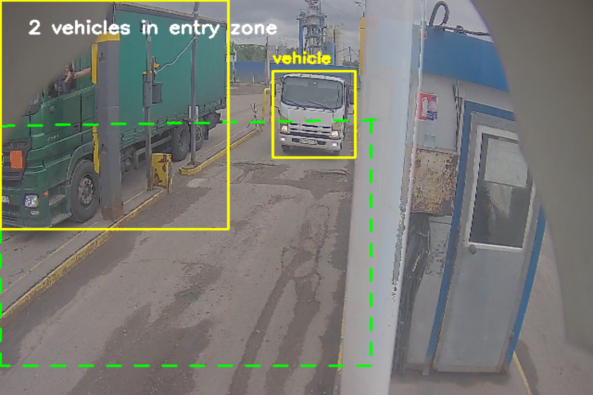

# Задание 1 (CV/ML):


Этот проект предназначен для **детектирования транспортных средств**, въезжающих в определённую **зону интереса (перед шлагбаумом)**, на видео при помощи модели **YOLOv11 нано**.

📦 В процессе:
- Видео ресайзится до нужного разрешения (640x480) для ускорения обработки.
- Зеленым пунктиром выделяется полигональная зона въезда (не считаем учитываем припаркованный транспорт и автомобили на заднем фоне)
- Производится детекция объектов, относящихся с транспортным средствам (предобученные классы в YOLO : `car`, `truck`, `bus`, `motorcycle`).
- Учитываются только те объекты, которые хотя бы частично попадают в зону.
- Транспортные средства в зоне въезда обводим bbox и производим подсчет.
- После NMS (Non-Maximum Suppression) убираются дублирующиеся объекты.

---


Примеры распознаваний:






## 📁 Структура проекта

```bash
vehicle-entry-detector/
├── car_cpu.ipynb            # Ноутбук 
├── polygon_utils.py         # Утилиты для полигона (масштаб, пунктир и пересечения)
├── yolo11n.pt               # Модель YOLOv11 (автоматически скачивается при запуске)
├── examples/                # Примеры работы детектора
│   ├
│   └── output_video_example.mp4
├── requirements.txt         # Зависимости проекта 
└── README.md                # Описание проекта
```

# Задача 2:

Турист вышел из палатки, прошел километр на юг, километр на восток, километр на север и оказался в
своей же палатке. Вычислить координаты палатки.

   Решение:
   a) Северный полюс — (90N, любая долгота).
   б) Бесконечно много локаций вблизи Южного полюса (примерные координаты: любая долгота, широта > 89.99S), чуть севернее широт, где окружность Земли на параллели = 1 км / n. (т.к. после полного круга на восток возвращаемся в ту же точку)

# Задача 3:

 В библиотеке стоят два томика Л.Н. Толстого. Толщина перелета каждого тома – 10мм. Толщина обложки 1 мм. Том вместе с обложкой 10 + 1 + 1 = 12 мм. Оба тома соответственно занимают 24мм. Блоха прогрызла нору от первой страницы первого тома до последней страницы второго. Определите длину пути.

   Решение: 
 2 мм. На полке передняя обложка каждого тома смотрит в сторону второго тома , т.е.  первая страница — с внутренней стороны, рядом со вторым томом.
У второго тома последняя страница — тоже с внутренней стороны, рядом с первым томом. Значит блоха прогрызла только обложки. 	

